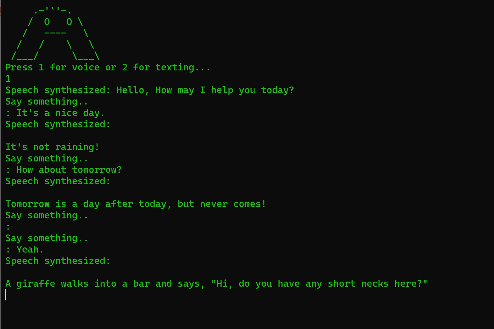

# Gortana GTP - Voice Chat Interface using Azure Cognitive Services and OpenAI ChatGTP

This project is a .NET 7.0 C# console application that utilizes Azure Cognitive Services and OpenAI ChatGTP to create a voice chat interface. 
With this project, you can have natural, voice-based conversations with a chatbot using your microphone.

## Installation

To install this project, you will need the following tools:

- .NET 7.0 or higher
- Visual Studio 2020 or higher
- Azure account with Cognitive Services enabled
- OpenAI API key for ChatGTP

Once you have these tools, follow these steps to install the project:

1. Clone or download this repository to your local machine.
2. Open the solution file (`.sln`) in Visual Studio.
3. Restore the NuGet packages by right-clicking the solution and selecting "Restore NuGet Packages".
4. Replace the placeholder values in the `App.config` file with your Azure Cognitive Services key and OpenAI API key.
5. Build and run the project by pressing F5 or selecting "Start" from the Debug menu.

## Tools Used

This project uses the following tools:

- .NET 7.0
- C#
- Azure Cognitive Services
- OpenAI ChatGTP API

## Resources

- [.NET 7.0](https://dotnet.microsoft.com/download/dotnet/7.0)
- [Visual Studio](https://visualstudio.microsoft.com/)
- [Azure Cognitive Services](https://azure.microsoft.com/en-us/services/cognitive-services/)
- [OpenAI ChatGTP API](https://beta.openai.com/docs/api-reference/chat/introduction)

## License

This project is licensed under the MIT License - see the [LICENSE](LICENSE) file for details.
